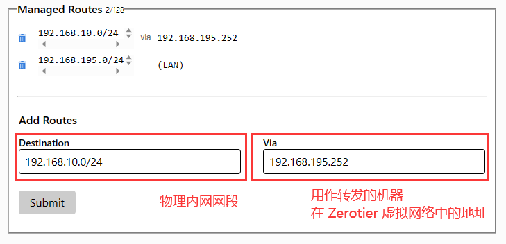
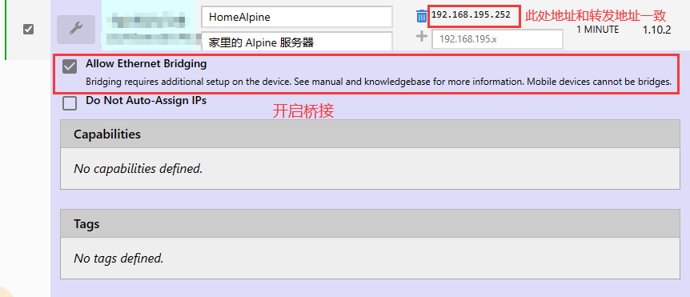

## 简介：
<p align="center">
<a target="_blank" href="https://github.com/DoTheBetter/docker/tree/master/zerotier-client"></a>


<br>
<a target="_blank" href="https://github.com/DoTheBetter/docker/pkgs/container/zerotier-client"></a>
<a target="_blank" href="https://hub.docker.com/r/dothebetter/zerotier-client"></a>


</p>

自用zerotier-client镜像，基础系统为alpine，支持amd64;arm64v8;arm32v7系统，可以设置为网关模式访问内网。 

项目地址：https://github.com/DoTheBetter/docker/tree/master/zerotier-client

### 官网地址

* https://www.zerotier.com
* https://github.com/zerotier/ZeroTierOne

### 网关模式用法

- 官方文档：https://docs.zerotier.com/route-between-phys-and-virt
- 假设 zerotier 虚拟局域网的网段是 `192.168.88.0` ，局域网 A `192.168.1.0` ，局域网 B `192.168.2.0`
- (如果需要互联) 在局域网 A 和 B 中需要各有一台主机安装 zerotier 并作为两个内网互联的网关
- 分别是 192.168.1.10（192.168.88.10） 192.168.2.10（192.168.88.20）# 括号里面为虚拟局域网的 IP 地址
- **docker宿主机必须开启TUN/TAP**

####  一、docker宿主机开启内核转发

```bash
echo "net.ipv4.ip_forward = 1" >> /etc/sysctl.conf
sysctl -p
```

####  二、zerotier 网站设置
1. 在 zerotier 网站的  Networks 里面的 Managed Routes 下配置路由表, 增加如下内容
```bash
192.168.1.0/24 via 192.168.88.10 
192.168.2.0/24 via 192.168.88.20 
```



2. 在下面Members列表里选择需要作为网关的客户端开启，点开小扳手，选择第一项`Allow Ethernet Bridging`



## 相关参数：

#### 环境变量
下面是可用于自定义安装的可用选项的完整列表。  
|变量名|是否必须|默认值|说明|
| :------: | :--------: | :------: | :----: |
|            `TZ`            |   可选   |  `Asia/Shanghai`  |                           设置时区                           |
|       `GATEWAY_MODE`       |   可选   |      `true`       |       网关模式开关，`true`网关模式， `false`单机模式。       |
|        `PHY_IFACES`        |   可选   |      `eth0`       | 网关模式时使用：物理网卡名称，可为`eth0`,` wlan0`,`eth0 wlan0`三种类型。 |
|       `IPTABLES_CMD`       |   可选   | `iptables-legacy` | 网关模式时使用：iptables版本：`iptables-legacy`、`iptables-nft`。部分宿主机命令不兼容时选择。 |
| `ZEROTIER_ONE_NETWORK_IDS` | **必须** |        无         | ZeroTier 网络 ID，设置时自动连接到ZeroTier network，相当于命令`zerotier-cli join $ZEROTIER_ONE_NETWORK_IDS` |

#### 开放的端口

|范围|描述|
| :----: | :----: |
|   `host`   | 作为网关使用时，网络模式必须为host |
| `9993/udp` |              单机模式              |

#### 数据卷

下面的目录用于配置，并且可以映射为持久存储。  

|目录|描述|
| :----: | :----: |
| `/var/lib/zerotier-one` | zerotier-one配置文件夹 |

## 部署方法：

> 本镜像在docker hub及ghcr.io同步推送，docker hub不能使用时可使用ghcr.io

### Docker Run
  ```bash
  # 网关模式
  docker run -d \
  	--net host \
  	--name zerotier-client \
  	--restart always \
  	--device /dev/net/tun \
  	--cap-add NET_ADMIN \
  	--cap-add SYS_ADMIN \
  	--cap-add NET_RAW \
  	-e GATEWAY_MODE=true \
  	-e ZEROTIER_ONE_NETWORK_IDS=1234567890 \
  	-v /docker/zerotier-client:/var/lib/zerotier-one \
  	dothebetter/zerotier-client:latest  #ghcr.io/dothebetter/zerotier-client:latest
  ```
### docker-compose.yml
```yml
# 网关模式
version: '3'
services:
  zerotier-client:
    image: dothebetter/zerotier-client:latest #ghcr.io/dothebetter/zerotier-client:latest
    container_name: zerotier-client
    restart: always
    network_mode: host
    devices:
       - /dev/net/tun
    cap_add:
       - NET_ADMIN
       - SYS_ADMIN
       - NET_RAW
    environment:
       - GATEWAY_MODE=true
       - ZEROTIER_ONE_NETWORK_IDS=1234567890
    volumes:
       - /docker/zerotier-client:/var/lib/zerotier-one
```

## 更新日志：
详见 **[CHANGELOG.md](./CHANGELOG.md)**